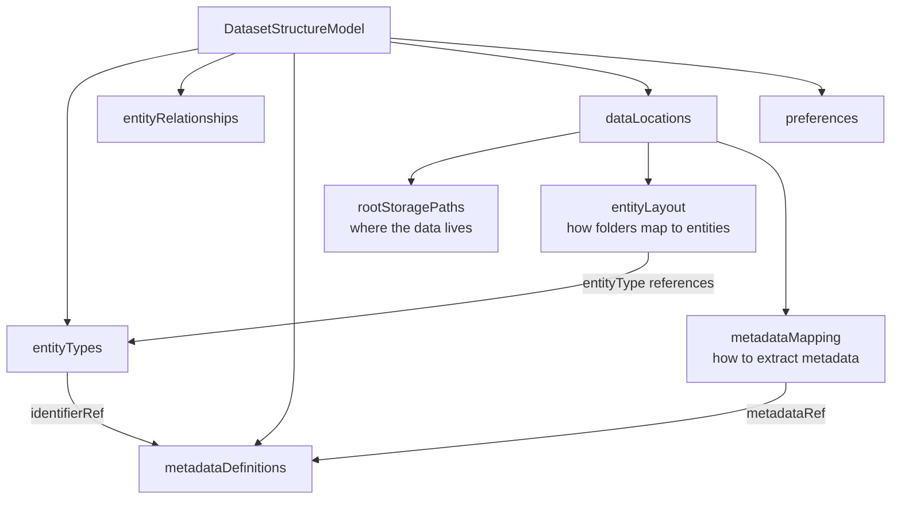

# Core Concepts

This page explains the key ideas behind DSM before you write your first config.

---

## The problem: heterogeneous folder structures

Scientific datasets rarely follow a single standard layout. Raw data acquired in a lab often looks like:

```
D:\Data\TwoPhoton\m110\20250523_session1\rec01\
```

While processed data for the same session might live at:

```
/Volumes/DataDrive/Processed/m110\20250523_session1\processed\
```

These two folders contain data about the same experimental session, but a tool has no way of knowing that without either hardcoded assumptions or a formal description. DSM is that formal description.

---

## Physical layout vs. semantic organisation

Every DSM config draws a clear line between two things:

**Physical layout** — the actual folder and file names on disk, their patterns, and their hierarchy.

**Semantic organisation** — the scientific meaning: that a folder named `m110` represents a *subject*, that `20250523_session1` is a *session*, that the `20250523` part is the *acquisition date*.

The `entityLayout` maps physical structure to semantic meaning. The `metadataDefinitions` and `metadataMapping` extract scientific metadata from the physical names.

---

## The five top-level concepts



### entityTypes

The semantic entities in your dataset — `subject`, `session`, `recording`, `trial`, etc. Each entity type can declare an `identifierRef`: the metadata field that uniquely identifies an instance of this entity across all data locations.

### metadataDefinitions

A global dictionary of metadata fields. Each field is associated with an entity type (`ofEntity`) and has a data type, optional unit, and optional validation rules. Fields defined here are the shared vocabulary used by all data locations.

### dataLocations

The heart of a DSM config. Each data location describes one folder tree — its category (raw, processed, derived...), root paths per environment, entity layout, and metadata extraction rules.

### entityRelationships

Semantic relationships between entity types (e.g. a subject *has many* sessions). Independent of physical storage — the same relationship holds regardless of which data location you are looking at.

### preferences

The active environment identifier and the default data location to use when a tool doesn't specify one.

---

## Data locations and entity layout

A `dataLocation` describes a single folder tree. Its `entityLayout` is an ordered array where each item represents one level of the hierarchy, from outermost to innermost:

```json
"entityLayout": [
  { "name": "subjects", "entityType": "subject", "matchPattern": "^[A-Za-z0-9]+$" },
  { "name": "sessions", "entityType": "session", "matchPattern": "^\\d{8}_.*$"    },
  { "name": "recordings","entityType": "recording","matchPattern": "^[A-Za-z0-9_-]+$" }
]
```

This says: at depth 0, folders matching `^[A-Za-z0-9]+$` are subjects. At depth 1 inside each subject, folders matching `^\d{8}_.*$` are sessions. At depth 2, folders matching `^[A-Za-z0-9_-]+$` are recordings.

---

## Metadata extraction

`metadataMapping` declares how to extract metadata values from folder or file names for a specific data location. Each item references a global `metadataDefinitions` key and provides extraction rules:

```json
{
  "metadataRef": "session_id",
  "extraction": {
    "method": "regex",
    "pattern": "^\\d{8}_(.+)$",
    "entityLayoutLevel": 1
  }
}
```

This extracts `session_id` from the session folder name (level 1) by capturing everything after the date prefix.

---

## Cross-location entity matching

The same session entity may appear in multiple data locations under different naming conventions:

- Raw: `20250523_session1` → `session_id = "session1"`
- Processed: `session-session1` → `session_id = "session1"`

By declaring `"identifierRef": "session_id"` on the `session` entity type, tools know that two session entities are the same real-world session if their extracted `session_id` values match — regardless of which location they come from. Parent entity identity is inherited from the hierarchy.

---

## Derived locations and path generation

When a data location is `derived` from another, it uses `pathComponentTemplate` to declare how to *generate* new output folder names from source entity metadata:

```json
{
  "name": "sessions",
  "entityType": "session",
  "pathComponentTemplate": "session-{session_id}"
}
```

A tool reads `session_id = "session1"` from the source entity and constructs the output path `session-session1/`. `matchPattern` is optional when a template is present; tools can derive the regex automatically.

---

## Multi-environment paths

A data location can have multiple `rootStoragePaths`, one per computing environment:

```json
"rootStoragePaths": [
  { "identifier": "windows-lab",  "path": "D:\\Data\\Raw",            "environment": "windows-lab" },
  { "identifier": "mac-analysis", "path": "/Volumes/DataDrive/Raw",    "environment": "mac-analysis" },
  { "identifier": "hpc",          "path": "/scratch/user/data/raw",    "environment": "hpc-cluster" }
]
```

`preferences.environmentIdentifier` selects which path to use at runtime.

---

## Next steps

- [Quick Start](quickstart.md) — create and validate your first config
- [Schema Reference](../reference/index.md) — complete field-level documentation
- [Usage Guide](../guides/usage-guide.md) — detailed walkthroughs of each feature
